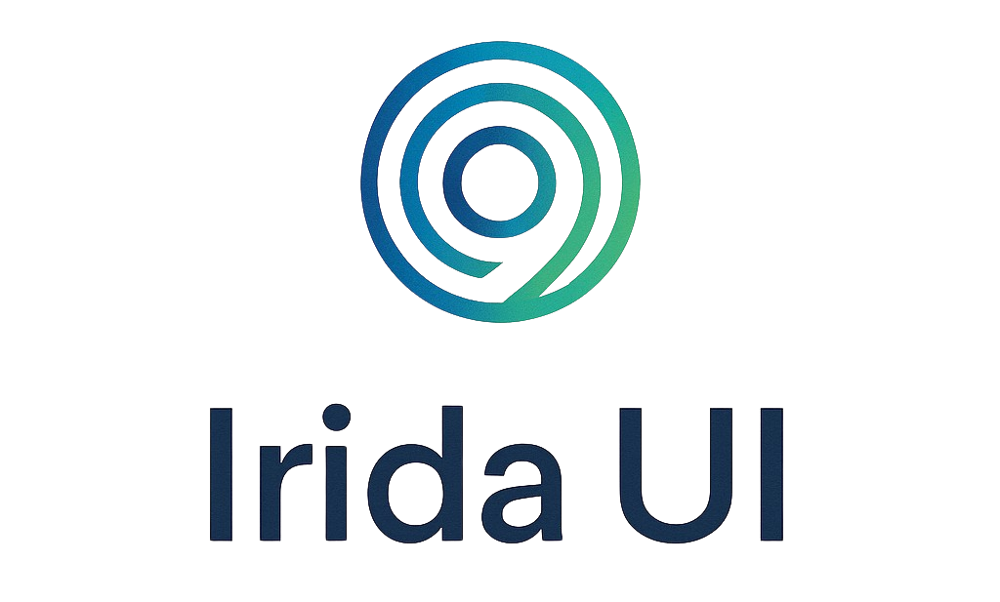

<div align="center" style="padding-bottom: 30px">
  
  <p></p>
</div>


**Irida UI** is a headless, accessible, framework-independent engine for orchestrating layered surfaces: dialogs, sheets, drawers, popovers, tooltips, banners, toasts, and more.
It gives you precise control over focus, depth, and interaction flow — the behavioral infrastructure beneath your design system.

**Irida UI** takes its name from _Iris_, the Greek word for **“rainbow”** and the root of terms related to apertures and visibility. The name reflects how layered interfaces open, close, and guide focus as users move through an application.

Whether you're building a cross-framework design system, a multi-app shell, or a custom component library, Irida UI provides the deterministic foundation you need to manage UI layers with confidence.

## Installation

```bash
npm install irida-ui
# or
yarn add irida-ui
# or
pnpm add irida-ui
```

## Usage

```typescript
import { /* ... */ } from "irida-ui/*";
```

## Development

```bash
# Build
yarn build

# Watch mode
yarn dev

# Test
yarn test

# Test (CI mode)
yarn test:ci
```

